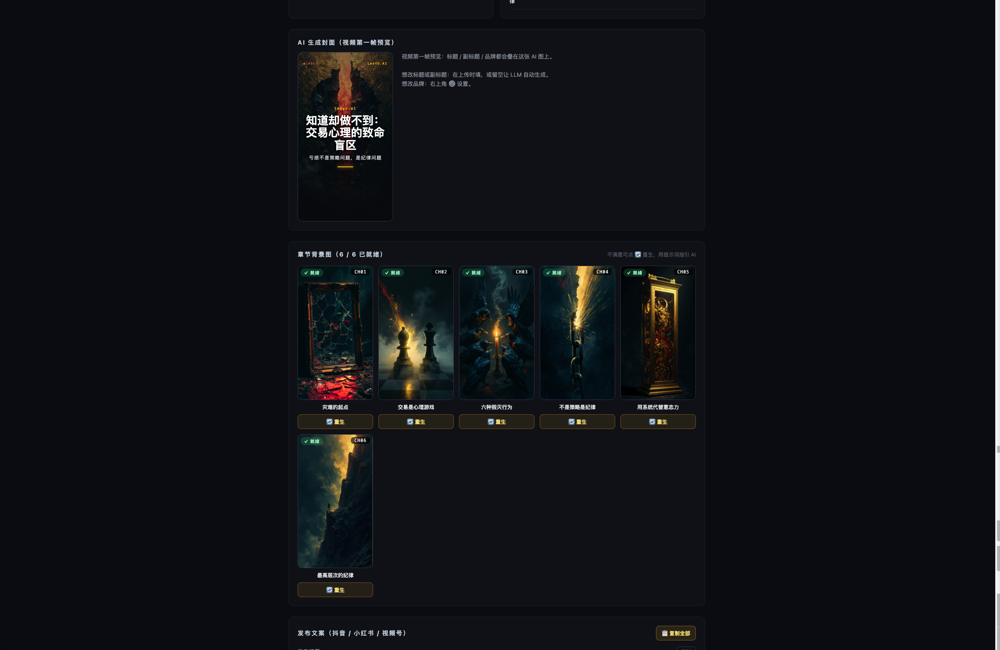
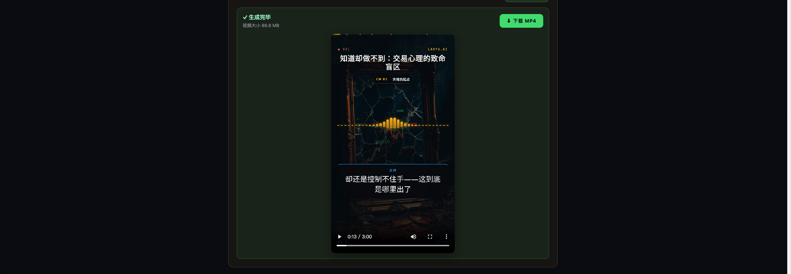

# podcast.cab · 播客视频生成器

[](LICENSE) [](https://podcast.cab) [](https://github.com/stonedad371/podcast2video/stargazers)



[**podcast.cab**](https://podcast.cab) 出品。一份 mp3 + SRT 字幕 → 一条可发布到抖音 / 小红书 / 视频号 / B 站 / YouTube 的短视频，外送一套发布文案。AI 全自动、完全本地。

支持 **9:16 竖屏 / 1:1 方形 / 16:9 横屏** 三种比例。

---

## 三步开始用

### 1. 安装 Docker Desktop 或 OrbStack（只需一次）

去 https://www.docker.com/products/docker-desktop 下载，或用 [OrbStack](https://orbstack.dev)（国内可下、更轻量）。装完打开等鲸鱼图标变绿。

### 2. 下载本项目

```bash
git clone git@github.com:stonedad371/podcast2video.git
cd podcast2video
```

### 3. 双击启动

- **Mac**：双击 `start.command`
- **命令行**：`docker compose up -d --build`

浏览器自动打开 http://localhost:3010，开干。

---

## 第一次使用：配置 API Key

右上角 ⚙️ 设置 → 填 MiniMax API key：

| Key | 干啥 | 哪里申请 |
|---|---|---|
| MiniMax | 切章节、挑金句、写标题副标题、生封面、每章生背景图、写发布文案 | https://platform.minimaxi.com/subscribe/token-plan?code=6Vt5rNAbqe&source=link |

Key 存在 `./data/config/api-keys.json`，权限 600，不会进 Docker 镜像也不会上传任何地方。

---

## 成品长这样

渲染完成后直接在浏览器里 9:16 播放 / 下载 mp4。下面这条是上面那份素材跑出来的成品片段：



---

## 工作流

```
拖入 mp3 + srt
  ↓ analyze（10-40s）
自动生成：视频标题 / 副标题 / 4-6 章节 / 3-5 金句 / 章节英文 prompt / 发布文案
  ↓ cover（15-30s）
AI 生 9:16 封面
  ↓ 批量 chapter images（1-2 分钟，5 张并行不并）
每个章节一张独立 AI 背景图（不满意点 🔄 重生）
  ↓ 你看缩略图满意 → 开始生成
渲染 mp4（3-5 分钟）
  ↓
在线播放器播 / 下载（文件名 = 你的中文标题）
+ 复制 抖音 / 小红书 / 视频号 发布文案（标题 + 简介 + 5-10 标签）
```

设置里勾"前序就绪后自动渲染"，整条管线一次跑完不用动手。

---

## 功能清单

**视频内容**

- ✅ 自动切 4-6 个章节、每章一句简短小标题
- ✅ 自动起视频标题 + 副标题（8-16 字带信息量）
- ✅ 自动挑 3-5 金句，金句出现时大字卡呈现（替代字幕）
- ✅ 全程字幕同步（速度 + 起点都跟音频对齐，**字幕时间补偿 slider** 可微调）
- ✅ 全程章节进度条（顶部带刻度）
- ✅ 持续显示当前章节标签
- ✅ 章节切换时弹胶囊章节卡 3.5s
- ✅ 浮动尘埃粒子 + 多向 Ken Burns 平移 + 章节切换柔光 flash
- ✅ 片尾 5s 自动出"关注 / 点赞 / 评论 / 收藏"4 个动效卡

**画面背景**

- ✅ AI 生 9:16 封面图（视频第一帧 = 平台抓首帧用的封面）
- ✅ **每章 AI 独立背景图**（共 4-6 张，跨章节 cross-fade）
- ✅ **章节图可重新生成**：单张点 🔄，填一句中文提示（如"画得更暗一点"、"用瀑布隐喻"），LLM 综合提示 + 字幕节选重写英文 prompt，再调 MiniMax 出图

**发布配套**

- ✅ 自动生成抖音 / 小红书 / 视频号 发布文案：
  - **标题**（带钩子的 15-30 字短文，可含 emoji）
  - **简介**（50-200 字含故事钩子 + 视频亮点 + 自然引导）
  - **5-10 个话题标签**（中文关键词，自动加 `#` 号）
- ✅ 每段独立复制 + 一键复制全部
- ✅ 下载视频文件名 = 你的中文视频标题（不再是 UUID）

**输出比例**

- ✅ 9:16 竖屏（1080×1920，抖音 / 小红书 / 视频号 / B 站竖屏 / YouTube Shorts）
- ✅ 1:1 方形（1080×1080，小红书图文位 / Instagram）
- ✅ 16:9 横屏（1920×1080，B 站 / YouTube / Bilibili）
- 三种比例在设置里切换；各元素位置按比例自动响应布局

**自定义**

- ✅ 自定义品牌名：设置里填，全视频替换 `podcast.cab` 字样
- ✅ accent 色、字幕时间补偿、视频比例、自动渲染开关 都在设置里

**工程**

- ✅ Next.js Web UI 拖拽上传
- ✅ Docker / OrbStack 一键启动（含 Chromium + ffmpeg + 中日韩字体）
- ✅ Remotion 渲染（React 渲染每一帧 → H.264 + AAC mp4，30fps）
- ✅ @remotion/player 浏览器实时预览（不用渲染就能看效果）
- ✅ 渲染完页面里直接 9:16/1:1/16:9 播放器播
- ✅ Range header 支持（音频/视频可 seek、大文件不爆内存）
- ✅ MiniMax 调用自动 retry 3 次（指数退避）抗网络抖动

---

## 自己改样式

全开源。配色 / 字体 / 布局 / 动效全部在 `remotion/Composition.tsx`：

- **三比例响应式布局表** 在 `LAYOUTS` 常量（每个比例的标题/字幕/章节位置都在这里调）
- **粒子数量、速度** 在 `PARTICLE_COUNT` + `VAmbientParticles`
- **Ken Burns 速度** 在 `VCoverBackground.scale` 计算
- **章节切换 flash** 在 `flashOpacity` 公式
- **片尾互动 CTA** 在 `VOutro.ctas` 数组

会 React 就能改。改完保存，dev 模式不需要重启容器（lib/render.ts 在 non-production 不缓存 serveUrl）。

---

## 系统要求

- macOS / Linux / Windows
- 8 GB 以上内存（Chromium 渲染要点资源）
- 5 GB 硬盘空间（Docker 镜像 + 渲染缓存）

---

## 关闭服务

```bash
docker compose down
```

---

## 路线图

- [ ] Windows 双击启动脚本（`start.bat`）
- [ ] 多语言字幕（目前只测过中文）
- [ ] 自定义视频时长内的分段（让用户拖时间轴选保留区间）
- [ ] 字体自定义入口
- [ ] Cover 编辑（不重生只换字 / 调位置）

---

## 许可

MIT
